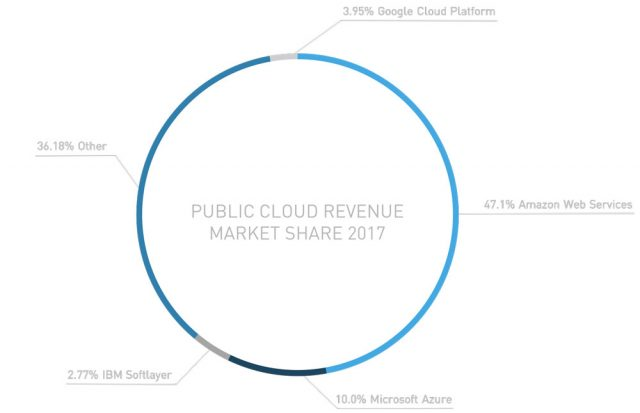

---
presentation:
  width: 960
  height: 800
  theme: night.css
  margin: 0.05
  minScale: 0.2
  maxScale: 0.5
  progress: true
  slideNumber: true
  keyboard: true
  hideAddressBar: true
  text-align: left
---

<!-- slide -->
# Cloud Computing

<!-- slide -->
Cloud computing is an information technology (IT) paradigm that enables ubiquitous access to shared pools of configurable system resources and higher-level services that can be rapidly provisioned with minimal management effort, often over the Internet. Cloud computing relies on sharing of resources to achieve coherence and economies of scale, similar to a public utility.

-- [Wikipedia](https://en.wikipedia.org/wiki/Cloud_computing)

<!-- slide -->
### Characteristics
----
- Trade cap ex for variable ex - Replace upfront capital infrastructure expenses with low variable running costs that can scale with business
- On-demand self-service - Speed and agility
- Ubiquitous network access - Go global
- Resource pooling - Economies of scale
- Rapid elasticity - Don't need to guess what is needed
- Pay as you go pricing - no need to pay and manage data centers

<!-- slide -->
### Rental Car Analogy
----

- Available when and where you need them
- pay only for the time of use
- You can DIY
- Many options available from the rental company
- Use the car you want for the situation
- Don't need to maintain a rental car
- If rental car breaks down, company can give you a new one
- Rent multiple cars when needed

<!-- slide -->
### Service & Deployment Models
----
- Service Models
	- SAAS
	- PAAS
	- IAAS

- Deployment Models
	- Public
	- Private
	- Community
	- Hybrid

<!-- slide -->
### Benefits
----
- Agility
- Scalability
- Economies of scale
- Sustainability
- Reliability
- Faster time to market
- Increased efficiency
- Try out stuff/ INNOVATION

<!-- slide -->
### Timeline
----

<!-- slide -->
# AWS 
### History & Where we are

<!-- slide -->
- Beginning in 2000
- Simple e-commerce company with scale problems
- Forced to build a solid internal system to deal with hyper growth experienced by them
- Around 3 years to make (start of 2000)

<!-- slide -->
### The Problems/Need
- Plan for merchant.com - third party merchants (Target etc.) to have e-commerce
- Not planned for that kind of scale
- Business wanted the app in 3 months - but 2 months were required for just build db, compute and storage component
- Everyone creating these resources with no scale or reuse in mind.
------
- So a set of common infra services need to be available - build it and it would be more useful than just for them

<!-- slide -->
### How it started
- Untangle the mess into a set of well documented APIs
- Helped merchant.com setup
- Also served internal audience to be more organised and disciplined in developing tools
- All teams to build a decoupled, API access fashion - peer to peer consumption
- They got good....

<!-- slide -->
### The AWS idea
- They thought - What Amazon is good at - Even running infra services - that dawned on them
- Build on top of it
- Operating system is/on the internet
- AWS build the components of the internet operating system

<!-- slide -->
### Where we are (little old 2017)

<!-- slide -->
### Where we are (survey 2018)

<!-- slide -->
### Why AWS is the leader
- First
- Competitors
	- Disruption dynamics - competition did not realise the potential of the market
	- attack the bottom of market - competitors did not worry
	- their core business would be disrupted - so in denial
	- they were not ready to speed up cannibalisation of their own business
- Margins
	- Operating under very low margins compared to the earlier competition (like HP, IBM, Oracle and even MS)

<!-- slide -->
### ... the leader
- Support
	- Provide good customer support compared to current competition (say Google)
	- Support at various levels - solution architects to account managers
	- Developer friendly tools
	- Market outreach
- High level of functionality provided
	- add continuously added by listening to customers
- Partner ecosystem
	- Salesforce, SAP
- Developer Love
- My opinion
<!-- slide -->

# AWS Basics

<!-- slide -->
### Global Infrastructure
- Over a million active customers in more than 190 countries

- 55 Availability Zones within 18 geographic Regions and 1 Local Region around the world 
- Plans for 12 more Availability Zones and four more Regions

<!-- slide -->
### ... Infrastructure that provides
- Low latency
- High throughput
- Geographic boundaries and data sovereignty laws
- Redundancy

<!-- slide -->

### Regions and Availability zones
- physical location in the world where there are multiple availability zones
- Availability zone consist of one or more discrete data centres, each with redundant power, networking and connectivity, housed in separate facilities
- more scalable , available and fault tolerant
- Each region isolated from other regions - for better fault tolerance and stability
<!-- slide -->

### More on Availability zones
- Av zones (within region) are isolated but connected by low-latency links. 
- Independent failure zone 
	- physically separated
	- lower risk flood planes
	- uninterruptible power supply
	- onsite backup generation
	- different power grids from independent utilities
	- Connected to multiple tier-1 transit providers
- Redundancy possible across av zones and even regions for data and instances

<!-- slide -->

### Security & Compliance
- Fedramp certified, Many others
- AWS manages security of the cloud, you manage security in the cloud
	- IAM
	- Security Groups
	- Secrets Manager
	- WAF and Shield
- Audited regularly

<!-- slide -->
### Access - Self Service 
- Management Console
- CLI
- SDKs

<!-- slide -->

## Key Services - Compute

<!-- slide -->

### EC2
- Compute capacity
- Reliable, Secure
- Under your control
- In expensive
	- On Demand
	- Reserved
	- Spot
- AMI and Instances

<!-- slide -->
### Lightsail
- VPS - cover everything you require for your project under one plan
----
### Elastic Beanstalk
- PAAS for webapps
----
### Lambda
- Serverless
- Zero administration
----
### Autoscaling
- Scale up or down as per need.
- You define the conditions
- Handling of spikes

<!-- slide -->
## Key Services - Storage

<!-- slide -->
### S3
- Object storage
- 11 9s
- Huge scale
- Storage classes
----
### EBS
- Block storage
- Used with EC2
- Automatically replicated within AZ

<!-- slide -->

### EFS
- File storage
- NAS like
- Shared across Instances
----
### Glacier
- Archiving storage
----
#### Storage Gateway
- Enables hybrid storage environment (on Prem + Cloud)

<!-- slide -->

## Key services - Database
<!-- slide -->

### Aurora
- MySQL and Postgres compatibile
- 5 times faster the MySQL
- Created by Amazon
- Managed
----
### RDS
- Relational DB service
- Managed
- Multi AZ DB - Standby
- Automated backups 

<!-- slide -->

### Dynamo DB
- NoSQL
- High scale
- Fit for gaming, IOT, ad-tech, web analytics etc.
- Managed
----
### Elastic cache
- Redis or Memcached

<!-- slide -->

## Key Services - NW and CDN
<!-- slide -->

### VPC
- Your own virtual network  - your network space
- Connect with on Prem using VPN connection
----

### CloudFront
- CDN
- Global reach
----

#### Route 53
- DNS
- Register and/or map domains to public its
----

#### Direct Connect
- Dedicated network connect with on Prem

<!-- slide -->
### ELB
- Load balancing
- Highly available, automatically scale and secure
- Classic (Simple) and App (For more sophisticated routing) LBs

<!-- slide -->

## Key Services - Management Tools
<!-- slide -->

### CloudWatch
- Monitoring
---
### EC2 Systems Manager
- Software inventory and patching
---
### CloudFormation
- Template based creation and management of set of machines 
---
### CloudTrail
- Audit logs for AWS usage 
---
### Config & Service Catalog
- Governance policies and Security governance
<!-- slide -->

### OpsWorks
- Chef based configuration management service
---
### Trusted Advisor
- Help reduce cost, increase performance, improve security of your AWS setup

<!-- slide -->

## Key Services - Analytics

<!-- slide -->

### Athena
- Querying S3 data using SQL
---
### EMR
- Managed Hadoop on AWS
- Support for Spark, Flink etc.
---
### CloudSearch
- Search solution for your app/service provided by Amazon
---
### Elasticsearch Service
- Managed Elasticsearch solution

<!-- slide -->
### Kinesis
- Platform for streaming data - analysis

### Redshift
- Petabyte scale Data warehouse

<!-- slide -->

## Key Services - Messaging
<!-- slide -->

### SQS
- Queue service
- Supports high scale and different paradigms
	- At least once
	- FIFO
	- Exactly once
---
### SNS
- Push Notifications
- Support for different channels
	- Email, SMS, Mobile Devices, SQS, Lambda, Webhooks
---
### SES
- Mailchimp like

<!-- slide -->
## Many Others
- Dev Tools 
- Migration services 
- Machine learning
- IOT
- Desktop
- Business Productivity
- Game development

<!-- slide -->

## EC2 Concepts

<!-- slide -->
### A Machine to do stuff

<!-- slide -->

### AMI
An Amazon Machine Image (AMI) is a template that contains a software configuration (for example, an operating system, an application server, and applications). From an AMI, you launch an instance, which is a copy of the AMI running as a virtual server in the cloud.

### Instance
An actual machine created from an AMI with a capacity determined by Instance Type

<!-- slide -->

### Instance Type
Different instance types for different purposes
- General Purpose
	- t2.nano - 1vCPU, 3 CPU Credits/ Hour, 0.5 GB Mem, EBS Storage
	- t2.micro - 1vCPU, 6 CPU Credits/ Hour, 1 GB Mem, EBS Storage
	- t2.2xlarge - 8vCPU, 81 CPU Credits/ Hour, 32 GB Mem, EBS Storage
- Compute optimized
	- c5.18xlarge - 72 vCPUs, 144 GB RAM

<!-- slide -->

### More Instance Types
- Memory optimised
	- x1e.xlarge - 4 vCPUs, 122 GB RAM (smallest)
	- x1e.32xlarge - 128 vCPUs, 3904 GB RAM
- Accelerated Computing
	- GPU based workloads
	- p3.2xlarge - 1 GPU, 8 vCPU, 61 GB RAM, 16 GB GPU mem
- Storage optimised

<!-- slide -->

### Storage
- Root Device Volume (used to boot the instance)
- Local Storage volumes (instance store volumes) - configurable at launch time 
- EBS volumes - Provides persistent storage. Other two, data is destroyed when instance stopped/terminated

<!-- slide -->
### References
- [A history of cloud computing - Computer Weekly](https://www.computerweekly.com/feature/A-history-of-cloud-computing)
- [A brief history of cloud computing - IBM](https://www.ibm.com/blogs/cloud-computing/2014/03/18/a-brief-history-of-cloud-computing-3/)
- [A Brief History of Cloud Computing - Dataversity](http://www.dataversity.net/brief-history-cloud-computing/)
- [How AWS came to be](https://techcrunch.com/2016/07/02/andy-jassys-brief-history-of-the-genesis-of-aws/)
- [Exclusive: The Story of AWS and Andy Jassy’s Trillion Dollar Baby](https://medium.com/@furrier/original-content-the-story-of-aws-and-andy-jassys-trillion-dollar-baby-4e8a35fd7ed)
- [The myth about how Amazon’s Web service started just won’t die](https://www.networkworld.com/article/2891297/cloud-computing/the-myth-about-how-amazon-s-web-service-started-just-won-t-die.html)
- [Why AWS has such a big lead in the cloud](https://techcrunch.com/2017/02/13/why-aws-has-such-a-big-lead-in-the-cloud/)

<!-- slide -->
... eferences
- [Amazon's CFO narrows down the success of its $10 billion cloud business to 3 factors](https://www.businessinsider.in/amazons-cfo-narrows-down-the-success-of-its-10-billion-cloud-business-to-3-factors/articleshow/53442380.cms)
- [Amazon Web Services: the secret to the online retailer's future success](https://www.theguardian.com/technology/2017/feb/02/amazon-web-services-the-secret-to-the-online-retailers-future-success)
- [How Amazon Web Services Surged Out of Nowhere](https://blog.hackerrank.com/how-amazon-web-services-surged-out-of-nowhere/)
- [How Amazon could kill Kubernetes with developer kindness](https://www.techrepublic.com/article/how-amazon-could-kill-kubernetes-with-developer-kindness/)
- [AWS 101: An Overview of Amazon Web Services Offerings](https://www.sumologic.com/aws/)
- [Overview of Amazon Web Services - AWS Whitepaper](https://docs.aws.amazon.com/aws-technical-content/latest/aws-overview/aws-overview.pdf?icmpid=link_from_whitepapers_page)

<!-- slide -->